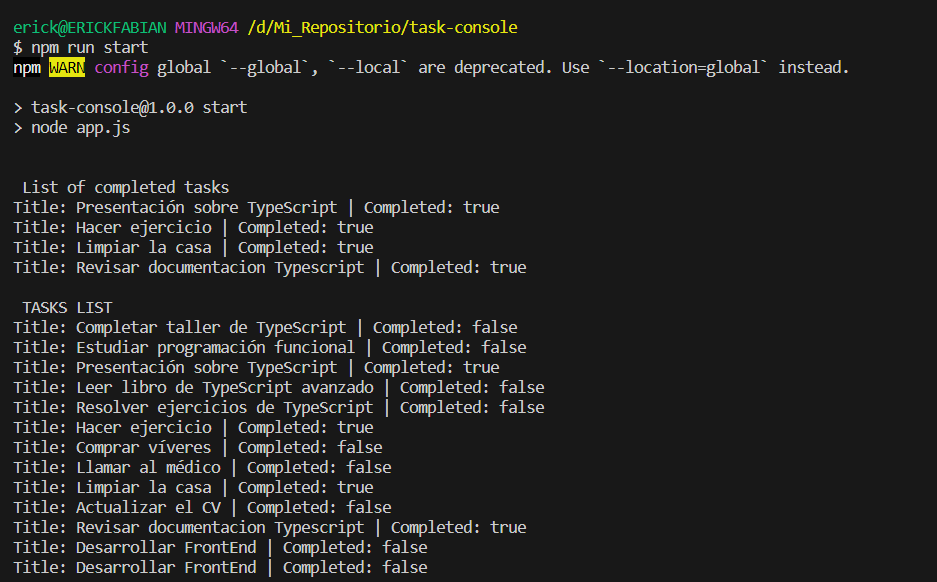

# TypeScript First Steps: Todo List Application

## Table of Contents 📄
- [Overview](#overview)
- [Installation](#installation)
- [Commands](#commands)
- [The Challenge](#the-challenge)
- [Screenshot](#screenshot)
- [My Process](#my-process)
- [Built With](#built-with)
- [What I Learned](#what-i-learned)
- [Continued Development](#continued-development)
- [Useful Resources](#useful-resources)
- [Author](#author)

## Overview

In this project, I created a basic todo list application using TypeScript. The application allows adding tasks, marking them as completed, and filtering completed tasks.

## Installation

1. Clone this repository to your local machine.
2. Open a terminal in the project directory.
3. Run `npm install` to install the dependencies.
4. Run `npm start` to start the application.

## Commands

- `npm run dev`: Compile and watch for changes in real-time with TypeScript.
- `npm run build`: Compile TypeScript files.
- `npm start`: Start the application with Node.js.

## The Challenge

The challenge was to apply the basic concepts of TypeScript and develop the necessary functions to manage the task list.

## Screenshot

## My Process

1. Defined the necessary types for tasks and the task list.
2. Implemented the `addTask`, `completeTask`, `filterTasks`, and `printTaskList` functions.
3. Used these functions in the `runApp` function to simulate the application flow.

## Built With

- TypeScript

## What I Learned

During this project, I reinforced my understanding of the following concepts:

- Defining types in TypeScript.
- Using functions and manipulating arrays in TypeScript.
- Basic structure of a TypeScript application.

## Continued Development

This project served as an introduction to TypeScript. In the future, I plan to expand it by adding a more user-friendly interface and additional options for tasks.

## Useful Resources

- TypeScript Documentation: [https://www.typescriptlang.org/docs/](https://www.typescriptlang.org/docs/)

## Author

This project created by erickfabiandev.
- [erickfabiandev](https://erickfabiandev.com)

